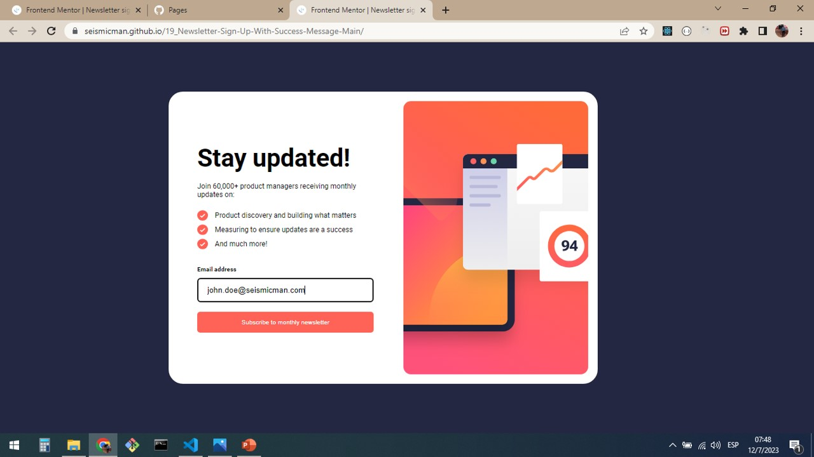
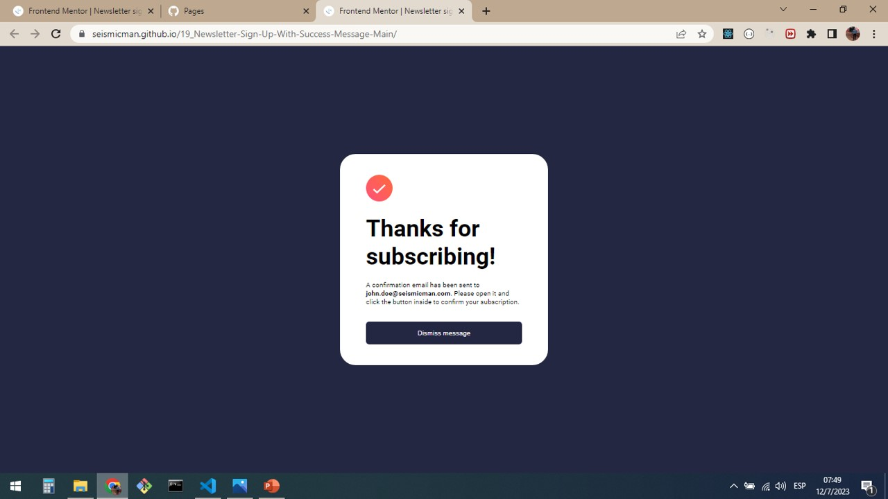

# Frontend Mentor - Newsletter sign-up form with success message solution

This is a solution to the [Newsletter sign-up form with success message challenge on Frontend Mentor](https://www.frontendmentor.io/challenges/newsletter-signup-form-with-success-message-3FC1AZbNrv). Frontend Mentor challenges help you improve your coding skills by building realistic projects.

## Table of contents

- [Overview](#overview)
  - [Screenshot](#screenshot)
  - [Links](#links)
- [My process](#my-process)
  - [Built with](#built-with)
  - [What I learned](#what-i-learned)
  - [Continued development](#continued-development)
  - [Useful resources](#useful-resources)
- [Author](#author)

## Overview

### Screenshots

### Links

Solution URL: [https://seismicman.github.io/17_Ping-Coming-Soon-Page-Master/](https://seismicman.github.io/17_Ping-Coming-Soon-Page-Master/)

## My process

### Built with

- Semantic HTML5 markup
- CSS custom properties
- Flexbox
- [React](https://reactjs.org/) - JS library

### What I learned

I developed this chalenge in React using components and CSS for the styles. It was so useful to understand the HTML elements as section, articles, input text and button. Also, in this project I used regular expressions to validate the character string for email.

Also, it was very useful to understand Flexbox to organize the different components of the User Interface and the use of media queries to switch between desktop and mobile versions.

it was interesting to learn about resources as ttf Fonts and how to use in our index.ccs

Regarding the functionality of this challenge in react, I used two components: "Card" and "Thank_you". Also three usestate to manage email, error and suscribed. With the value of these parameters I used conditional rendering to show the elements and error messages.

### Continued development

I would like to continue developing this challenges using React as main resource and complementing with other ones as HTML5, CSS, SAAS, Bootstrap, Tailwind among others.

### Useful resources

- [https://www.youtube.com/@FaztCode <- To learn about tech for developers](https://www.youtube.com/@FaztCode) - Fun youtube channel where you will find a wide variety of topics about technology for developers. It was very useful for me to deploy my projects on github and github pages.
- [https://jonmircha.com/cursos <- To learn about frontend resources](https://jonmircha.com/cursos) - This is an amazing spanish channel when do you can learn about HTML5, CSS, React, Git and Github, among others. I'd recommend it to anyone still learning about these resources.

## Author

- Frontend Mentor - [@seismicman](https://www.frontendmentor.io/profile/seismicman)
